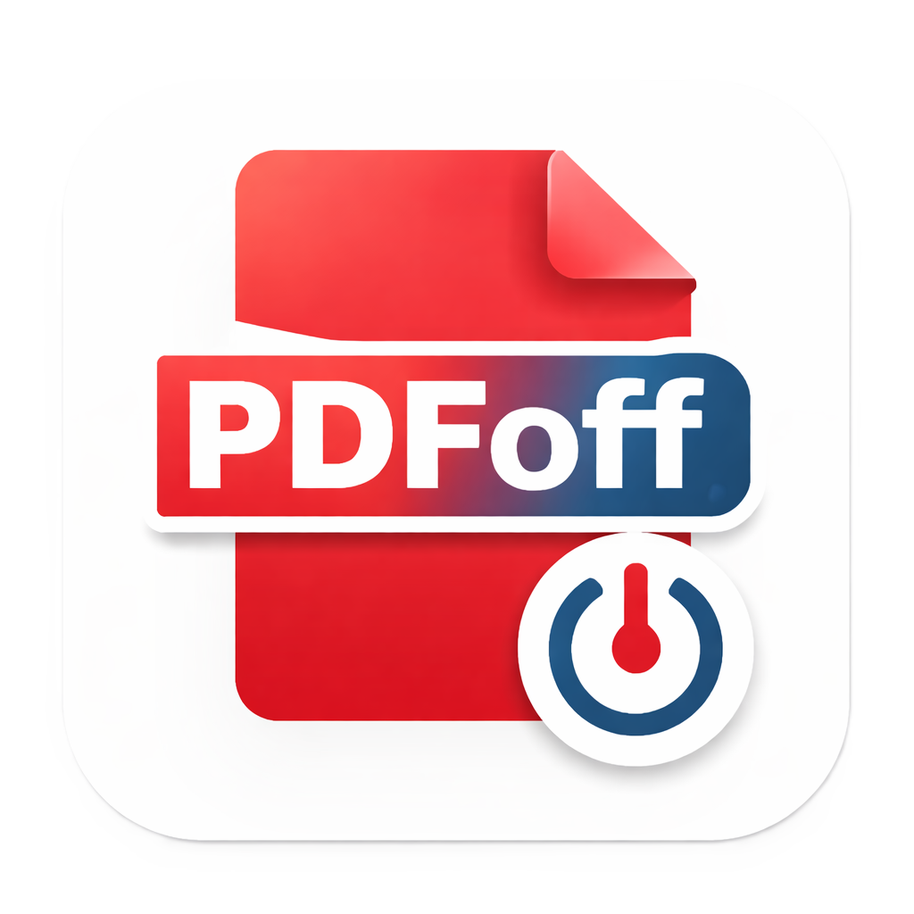

# PDFoff Viewer

A lightweight, native PDF viewer built with Electron and React.



## Features

- **Multi-tab support** — Open multiple PDFs simultaneously with a tab bar
- **Smooth zoom** — Ctrl+scroll wheel with cursor-anchored zooming and acceleration
- **Fit controls** — Fit full page, fit width, and reset zoom buttons
- **Text selection & copy** — Select text across pages with right-click copy menu
- **Drag & drop** — Drop PDF files anywhere to open them
- **File associations** — Double-click `.pdf` files to open in PDFoff Viewer (Windows)
- **Animated welcome screen** — App icon splash on startup

## Install

Download the latest installer from the [Releases](../../releases) page:

- **Windows:** `PDFoff Viewer Setup 1.0.0.exe`

## Development

### Prerequisites

- Node.js 20+
- npm

### Setup

```bash
npm install
```

### Run in development

```bash
npm run dev:electron
```

This starts the Vite dev server and launches Electron with hot reload.

### Build installer

```bash
npm run build:electron
```

Produces the installer in the `release/` directory.

## Tech Stack

- [Electron](https://www.electronjs.org/) — Native desktop shell
- [React](https://react.dev/) — UI framework
- [PDF.js](https://mozilla.github.io/pdf.js/) — PDF rendering engine
- [Tailwind CSS](https://tailwindcss.com/) — Styling
- [Vite](https://vite.dev/) — Build tooling
- [electron-builder](https://www.electron.build/) — Packaging & distribution

## License

MIT
